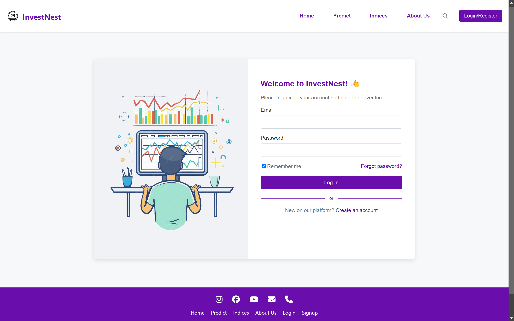
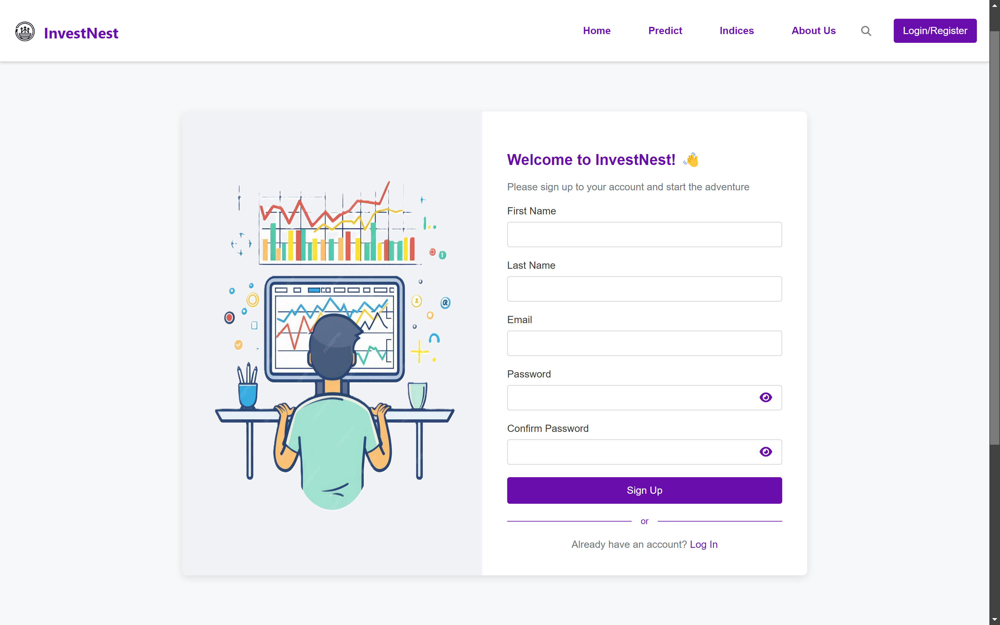
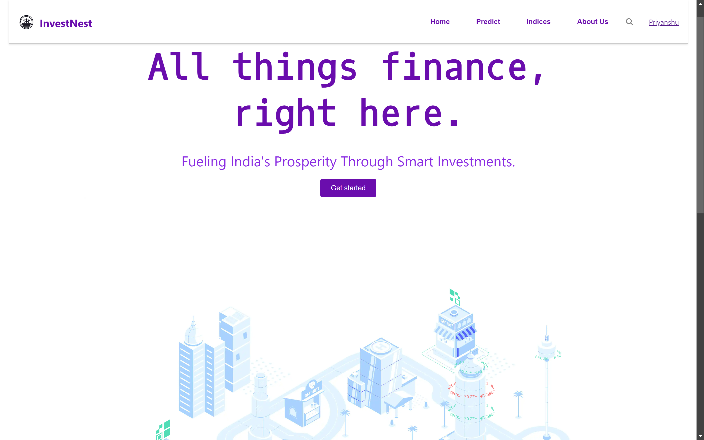
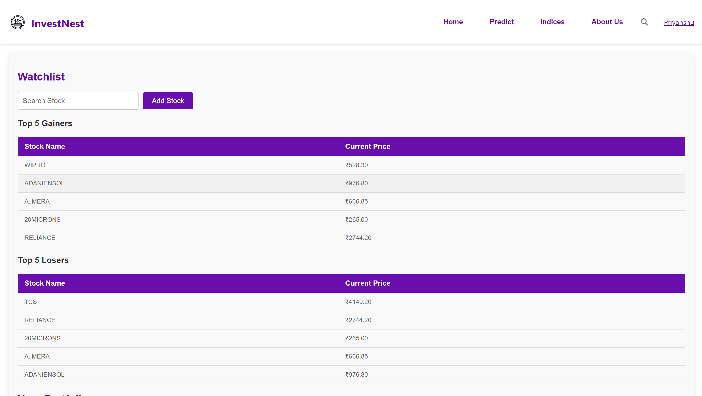
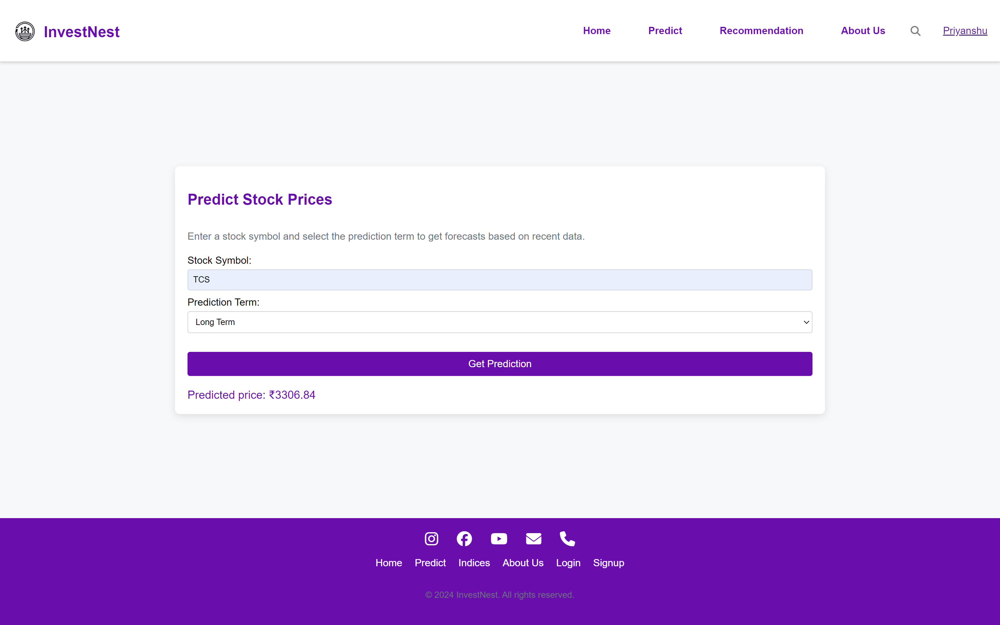
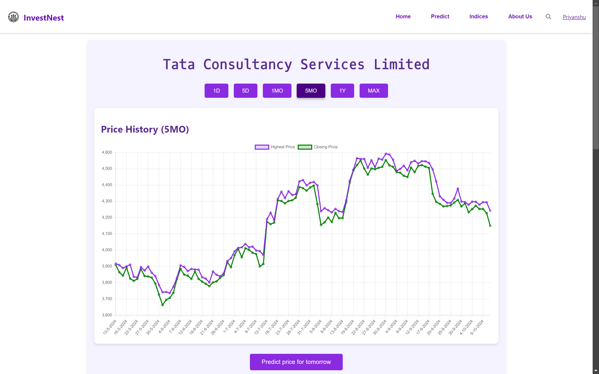
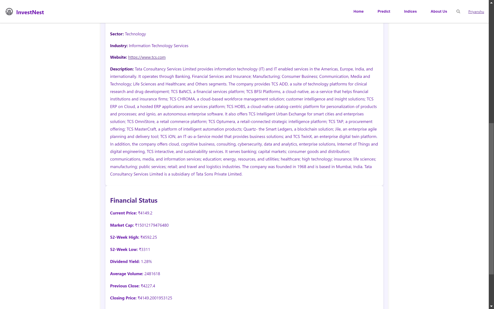
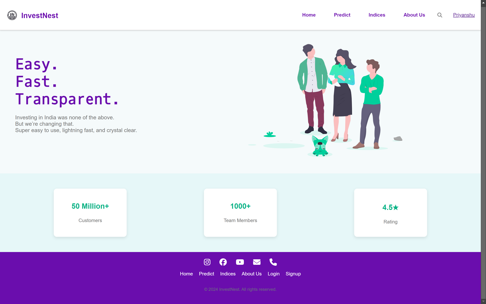

# InvestNest 🌟

**InvestNest** is a full-stack stock market web application that allows users to monitor stock market data, create watchlists, view indices information, and predict stock prices based on machine learning algorithms. This app is built using **React.js** for the frontend, **Python (Flask)** for the backend, and **MongoDB** for data storage. 

The project incorporates real-time stock data, predictions using technical indicators (SMA, Linear Regression, etc.), and offers secure authentication for user login and registration. 🔒

## Table of Contents
- [Features](#features)
- [Technologies Used](#technologies-used)
- [Project Structure](#project-structure)
- [Setup and Installation](#setup-and-installation)
- [Usage](#usage)
- [Screenshots](#screenshots)
- [License](#license)

## Features
- **Stock Watchlist** 📈: Add and remove stocks from a personalized watchlist.
- **Indices Info** 📊: Real-time updates on major stock indices.
- **Stock Price Prediction** 🔮: Predict short-term and long-term stock prices using **SMA-30** and **SMA-50** and **Linear Regression**.
- **Real-time Stock Data Charts** 📉: Visualize stock prices using Chart.js for various time frames (1 day, 5 days, 1 month, 15 months, 1 year, and lifetime).
- **Search Functionality** 🔍: Search for any NSE-listed stock and view detailed information, including financial status and price history.
- **Top 5 Gainers/Losers** 📉📈: View the top 5 market gainers and losers.
- **User Authentication** 🔑: Secure login and signup with JWT authentication.
- **Profile Management** 👤: Edit user profile and view dashboard information.

## Technologies Used

### Frontend
- **React.js**: For building the UI components.
- **CSS**: For styling the application.
- **Chart.js**: For creating real-time stock charts.

### Backend
- **Python (Flask)**: Backend server to handle requests and responses.
- **MongoDB**: NoSQL database for storing user data, stock data, and predictions.
- **YFinance**: Fetch real-time stock data.
- **Pandas**: Data manipulation and analysis.
- **Scikit-learn (Linear Regression)**: For predictive modeling.
- **TA-Lib**: For technical analysis (e.g., calculating SMA).
- **ARIMA**: Time series forecasting model.
- **Pymongo**: To interact with the MongoDB database.

## Project Structure


```
/stock-predictor
│
├── Backend/
│   ├── app.py
│   ├── db_operations.py
│   ├── routes.py
│   ├── stock_analysis.py
│   ├── utils.py
│   └── __pycache__/
│
├── public/
│   ├── full_company_names.csv
│   ├── images/
│   └── logo.png
│
├── src/
│   ├── Aboutus/
│   ├── Authentication/
│   ├── components/
│   ├── Dashboard/
│   ├── Footer/
│   ├── Indices/
│   ├── Home_content/
│   ├── Login/
│   ├── Navbar/
│   ├── PredictPage/
│   ├── StockInfoPage/
│   └── index.js
│
├── package.json
├── package-lock.json
└── README.md
```


## Setup and Installation

### Prerequisites
- **Node.js** and **npm**
- **Python 3.x** and **pip**
- **MongoDB** instance (local or cloud)

### Backend Setup
1. Clone the repository:
    ```bash
    git clone https://github.com/yourusername/investnest.git
    cd investnest/Backend
    ```

2. Install the required Python libraries:
    ```bash
    pip install -r requirements.txt
    ```

3. Run the Flask backend server:
    ```bash
    python app.py
    ```

### Frontend Setup
1. Navigate to the frontend directory:
    ```bash
    cd investnest
    ```

2. Install frontend dependencies:
    ```bash
    npm install
    ```

3. Run the React development server:
    ```bash
    npm start
    ```

### MongoDB Setup
Make sure you have a MongoDB instance running, either locally or on a cloud service like MongoDB Atlas. Update the connection URL in `db_operations.py`.

## Usage

1. Sign up and log in to access the dashboard. 🛠️
2. Search for any stock and view its current price and details. 📊
3. Add stocks to your watchlist. 📋
4. View stock charts with real-time data updates for different time ranges. 📈
5. Predict stock prices using historical data and the built-in machine learning models. 🤖

## Screenshots









## License
This project is licensed under the MIT License. 📜
