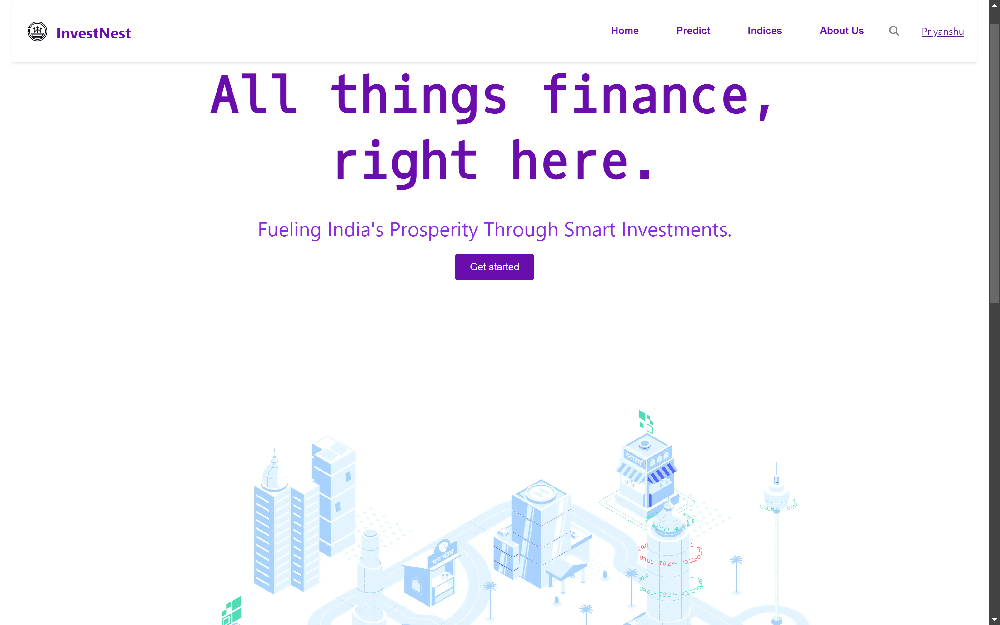
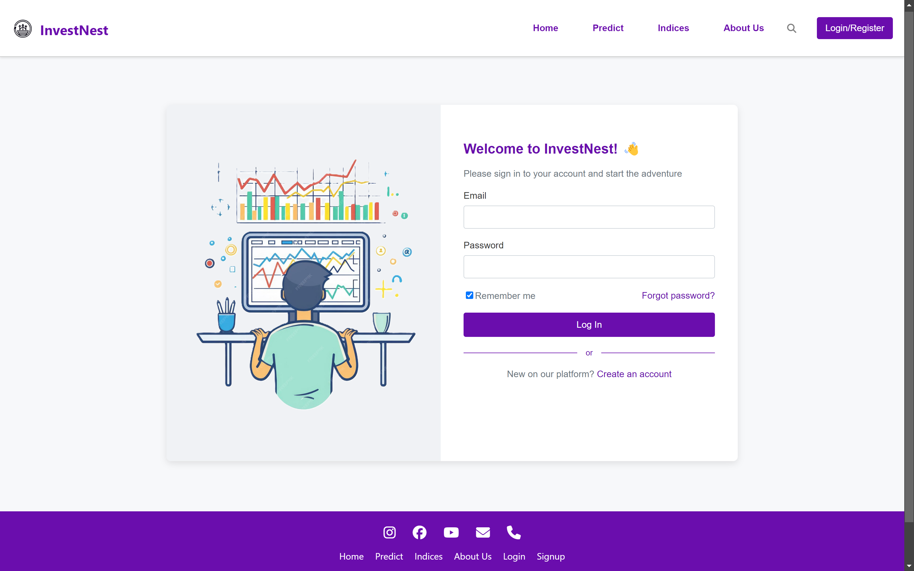
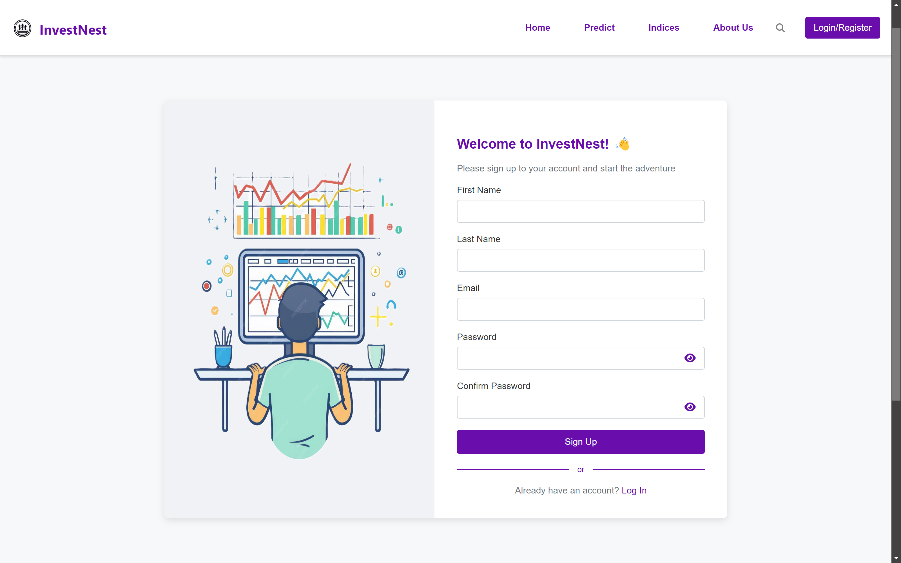
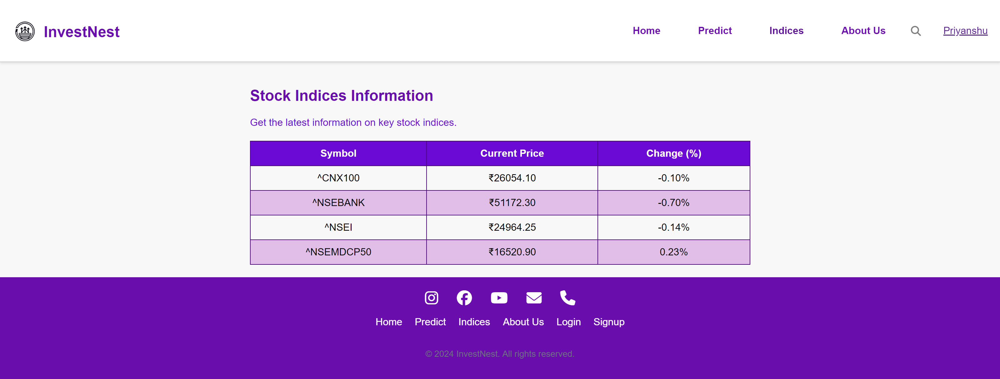
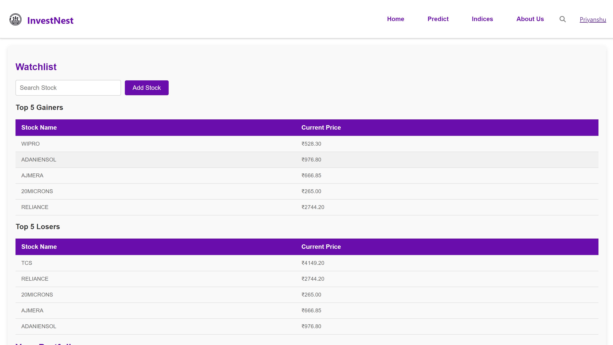
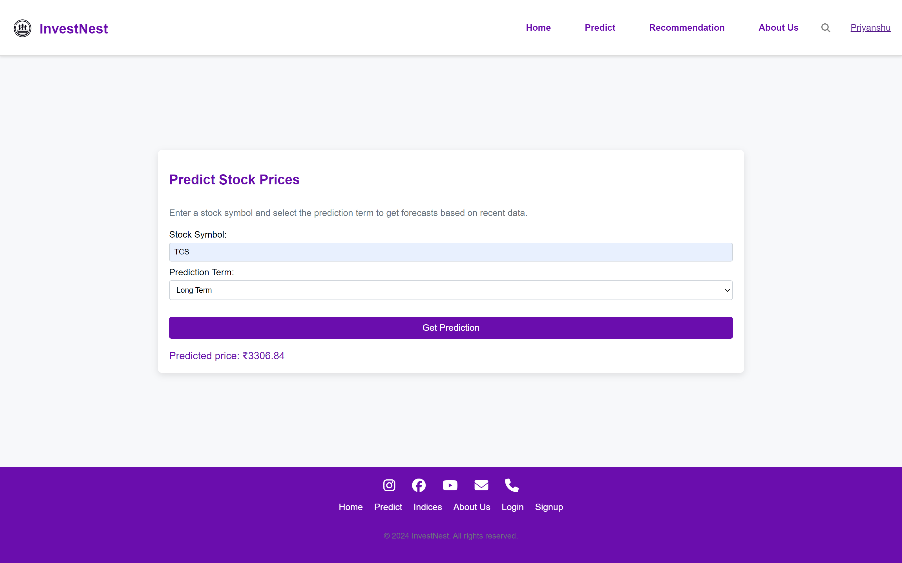
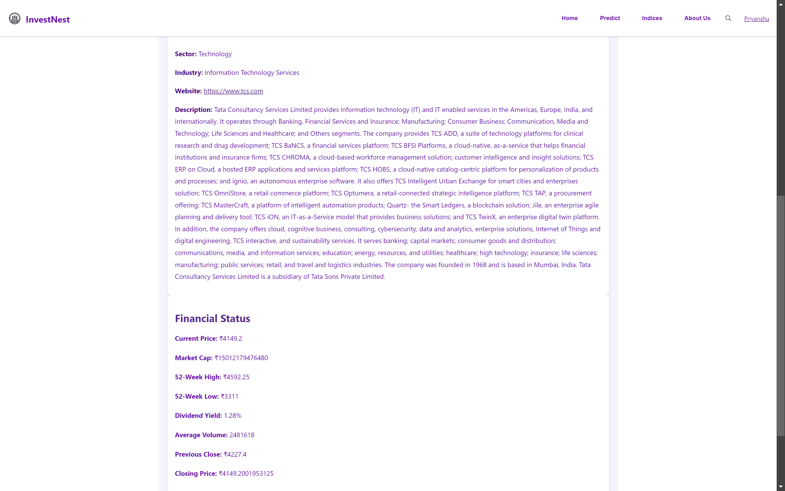
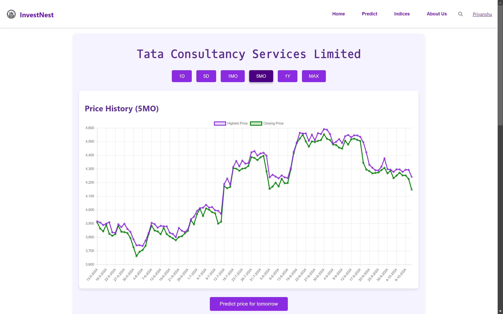

<div align="center">

# 🪺 InvestNest

**A full-stack stock market intelligence platform for Indian equity markets**

[](https://reactjs.org/)
[](https://flask.palletsprojects.com/)
[](https://www.mongodb.com/)
[](https://opensource.org/licenses/MIT)

</div>

---

## 📌 Overview

**InvestNest** is a full-stack web application designed to give retail investors a powerful, data-driven view of the Indian stock market (NSE). It combines real-time market data, interactive charts, a personal stock watchlist, and machine learning–based price predictions — all under one roof.

Whether you're tracking the NIFTY 50, monitoring a handful of favourite stocks, or trying to gauge a stock's short-term or long-term direction, InvestNest provides the tools to do it seamlessly.

---

## 🗂️ Table of Contents

- [Features](#-features)
- [How It Works](#-how-it-works)
- [Tech Stack](#-tech-stack)
- [Project Structure](#-project-structure)
- [API Reference](#-api-reference)
- [ML Models](#-ml-models)
- [Setup & Installation](#-setup--installation)
- [Screenshots](#-screenshots)
- [License](#-license)

---

## ✨ Features

| Feature | Description |
|---|---|
| 🔐 **User Authentication** | Secure signup and login with session-based auth via React Context |
| 📊 **Live Market Indices** | Real-time data for NIFTY 50, NIFTY Bank, CNX 100, and NIFTY Midcap 50 |
| 🔍 **Stock Search** | Search any NSE-listed company by name or ticker symbol |
| 📈 **Interactive Charts** | Visualise price history across 1D, 5D, 1M, 3M, 1Y, and all-time ranges |
| 📋 **Personal Watchlist** | Add/remove stocks to a personal portfolio stored in the cloud |
| 🔮 **Price Predictions** | Short-term (next-day) and long-term (30-day) price predictions using ML |
| 🏆 **Top Gainers & Losers** | Dashboard showing the top 5 gainers and losers from your watchlist |
| 👤 **Profile Management** | Edit your profile details and view your investment dashboard |
| ℹ️ **Detailed Stock Info** | Access financials, company metadata, and historical performance per stock |

---

## ⚙️ How It Works

```
┌────────────────────────────────────────────────────────────────┐
│                        React Frontend                          │
│  Home → Search → Stock Info Page → Watchlist → Predict Page   │
└───────────────────────┬────────────────────────────────────────┘
                        │  HTTP (Axios)
                        ▼
┌────────────────────────────────────────────────────────────────┐
│                     Flask REST API                             │
│  routes.py  ──►  stock_analysis.py  ──►  yfinance (NSE data)  │
│             ──►  db_operations.py   ──►  MongoDB               │
└────────────────────────────────────────────────────────────────┘
```

1. **User visits the app** → React Router handles navigation between pages.
2. **Authentication** → On login/signup the user's credentials are stored in MongoDB. An `AuthContext` provider keeps the session alive across the React component tree. Protected routes are guarded by a `PrivateRoute` component.
3. **Stock data** → The Flask backend fetches live and historical NSE data using the **yfinance** library and returns it as JSON.
4. **Charts** → The frontend renders price history with **Chart.js** / **react-chartjs-2**, supporting multiple time-range selectors.
5. **Watchlist** → Stocks are persisted per user in MongoDB. The portfolio endpoint returns current prices and predictions for each watched stock.
6. **Predictions** → When a user requests a prediction, Flask passes the ticker to `stock_analysis.py`, which runs either the short-term or long-term ML pipeline and returns a predicted price.

---

## 🛠️ Tech Stack

### Frontend

| Technology | Purpose |
|---|---|
| **React 18** | UI component library and routing (`react-router-dom`) |
| **Chart.js + react-chartjs-2** | Interactive, responsive stock price charts |
| **Axios** | HTTP client for communicating with the Flask API |
| **AOS** | Scroll-based animations |
| **PapaParse** | CSV parsing for the company name lookup list |
| **Font Awesome** | Icon set used throughout the UI |
| **CSS (custom)** | Component-level styling |

### Backend

| Technology | Purpose |
|---|---|
| **Python 3** | Primary backend language |
| **Flask** | Lightweight REST API framework |
| **Flask-CORS** | Cross-origin resource sharing for the React dev server |
| **yfinance** | Fetches real-time and historical NSE stock data |
| **Pandas** | Data wrangling and time-series manipulation |
| **scikit-learn** | Linear Regression for short-term price prediction |
| **ta (Technical Analysis)** | Calculates SMA, RSI, and other indicators |
| **statsmodels (ARIMA)** | Time-series forecasting for long-term prediction |
| **PyMongo** | MongoDB driver for Python |
| **MongoDB** | NoSQL database storing user profiles and watchlists |

---

## 📁 Project Structure

```
InvestNest/
│
├── Backend/                    # Python / Flask REST API
│   ├── app.py                  # App factory & entry point
│   ├── routes.py               # All API route definitions
│   ├── stock_analysis.py       # ML prediction logic (short & long term)
│   ├── db_operations.py        # MongoDB connection & initialisation
│   └── utils.py                # Helper utilities (e.g., symbol mappings)
│
├── public/                     # Static assets served by React
│   ├── full_company_names.csv  # NSE company name → symbol mapping
│   └── logo.png
│
├── src/                        # React application source
│   ├── Authentication/         # AuthContext, PrivateRoute, useAuth hook
│   ├── Home_content/           # Landing / home page
│   ├── Login/                  # Login & signup pages + success screen
│   ├── Dashboard/              # User portfolio & top gainers/losers
│   ├── Indices/                # Live market indices page
│   ├── StockInfoPage/          # Detailed stock view with charts
│   ├── PredictPage/            # ML price prediction interface
│   ├── Navbar/                 # Top navigation bar
│   ├── Footer/                 # Site footer
│   ├── Aboutus/                # About the project page
│   ├── components/             # Shared reusable components
│   ├── EditProfile.js          # Profile edit form
│   ├── App.js                  # Root component with route definitions
│   └── index.js                # React entry point
│
├── IMG/                        # Screenshot assets used in README
├── package.json                # Frontend dependencies & scripts
└── README.md
```

---

## 📡 API Reference

All API endpoints are served by the Flask backend running on `http://localhost:5000`.

| Method | Endpoint | Description |
|---|---|---|
| `GET` | `/stock_indices` | Returns current price & % change for NIFTY 50, NIFTY Bank, CNX 100, NIFTY Midcap 50 |
| `GET` | `/api/stock/<symbol>?period=1y` | Returns full stock info and price history for an NSE symbol |
| `POST` | `/predict` | Accepts `{ stock_symbol, term }` and returns a predicted price |
| `POST` | `/submit-form` | Registers a new user (signup) |
| `POST` | `/api/login` | Authenticates a user and returns profile data |
| `GET` | `/user-portfolio?email=` | Returns portfolio stocks with current prices and predictions |
| `POST` | `/add-stock` | Adds a stock symbol to the user's watchlist |
| `DELETE` | `/delete-stock` | Removes a stock symbol from the user's watchlist |

---

## 🤖 ML Models

### Short-Term Prediction (next trading day)

Uses **Linear Regression** from scikit-learn trained on the following features derived from historical daily close prices:

- **SMA-30** — 30-day Simple Moving Average
- **SMA-100** — 100-day Simple Moving Average
- **RSI** — 14-day Relative Strength Index

The model is trained on data from 2020 to the current date and predicts the next closing price.

### Long-Term Prediction (30 trading days)

Uses an **ARIMA(5, 1, 0)** model from statsmodels trained on 5 years of daily price data. The differenced price series is forecasted 30 steps forward and the cumulative sum is added to the last known price to produce the 30-day outlook.

---

## 🚀 Setup & Installation

### Prerequisites

- **Node.js** ≥ 16 and **npm**
- **Python** ≥ 3.8 and **pip**
- **MongoDB** running locally (`mongodb://localhost:27017/`) or a [MongoDB Atlas](https://www.mongodb.com/cloud/atlas) URI

---

### 1. Clone the repository

```bash
git clone https://github.com/Priyanshu147/InvestNest.git
cd InvestNest
```

### 2. Backend setup

```bash
cd Backend
pip install flask flask-cors pymongo yfinance pandas scikit-learn ta statsmodels
python app.py
```

The API server starts at **http://localhost:5000**.

> **MongoDB connection:** The default connection string in `db_operations.py` is `mongodb://localhost:27017/`. Update it to your Atlas URI if you are using a cloud database.

### 3. Frontend setup

Open a new terminal in the project root:

```bash
npm install
npm start
```

The React app starts at **http://localhost:3000**.

---

## 📸 Screenshots

| | |
|---|---|
|  |  |
| **Home Page** | **Login Page** |
|  |  |
| **Signup Page** | **Live Indices** |
|  |  |
| **Watchlist / Portfolio** | **Price Prediction** |
|  |  |
| **Stock Detail Page** | **Interactive Charts** |

---

## 📄 License

This project is licensed under the **MIT License**. See the [LICENSE](LICENSE) file for details.
